# 📑 ➜ Aumente seu ratio com Autobrr

## 1. Introdução

O autobrr é uma aplicação que se conecta ao seu tracker via; RSS, IRC e outros tipos de conexões. Para baixar os torrents assim que aparecem nos trackers.

**Os benefícios de se utilizar são;**

- Entrar no swarm inicial, melhor janela para se conseguir upar mais para outros leechers
- Filtrar o que você quer baixar de forma automática
- Ajuda melhorar seu ratio, você não irá ter que acessar o tracker para baixar o .torrent e adicionar ao seu client.

:::info Neste tutorial será necessário instalar WSL e Docker no seu computador. Caso você não seja um usuário windows, pode seguir para a etapa **DEPLOY AUTOBRR**.
:::

## Instalação

Basta acessar a página de releases do github:

https://github.com/autobrr/autobrr/releases

E baixar o pacote: contendo o nome "windows_x86_64.zip" clique em "show all assets" caso não apareça.

Descompacte e coloque tudo em "C:\autobrr" ou algum outro diretório.

Execute o autobrr.exe

Para mais informações acesse: https://autobrr.com/installation/windows

Após instalado siga para sessão **CONFIGURANDO AUTOBRR**.

## Instalação do WSL

Aperte "Win+X" e selecione a opção "powershell admi"

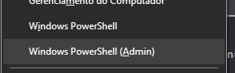

execute o comando:

`wsl --install`

Reinicie seu computador após o término da instalação

**INSTALANDO DOCKER DESKTOP**
Acesse a página: https://www.docker.com/products/docker-desktop/

E baixe o executável, realize a instalação.

**BAIXANDO UBUNTU 20.04**
Acesse a loja de softwares do windows e procure por "UBUNTU 20.04"

Realize a instalação e execute, irá abrir uma janela informando para aguardar alguns minutos. Depois, informe o usuário que você deseja criar e uma senha.

**INTEGRANDO UBUNTU COM DOCKER**

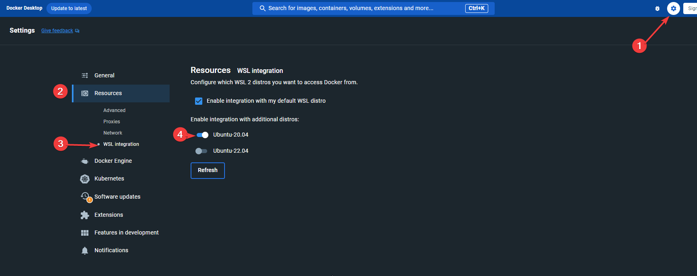

Siga a instrução conforme o print acima. Caso a janela do ubuntu 20.04 esteja aberta, feche e abra novamente. Irá estar no seu menu iniciar, basta pesquisar.

### INSTALANDO AUTOBRR

Com o UBUNTU 20.04 aberto, na linha de comando digite:

` mkdir -p autobrr/config`

Teste se o docker está funcionando, basta digitar:

` docker`

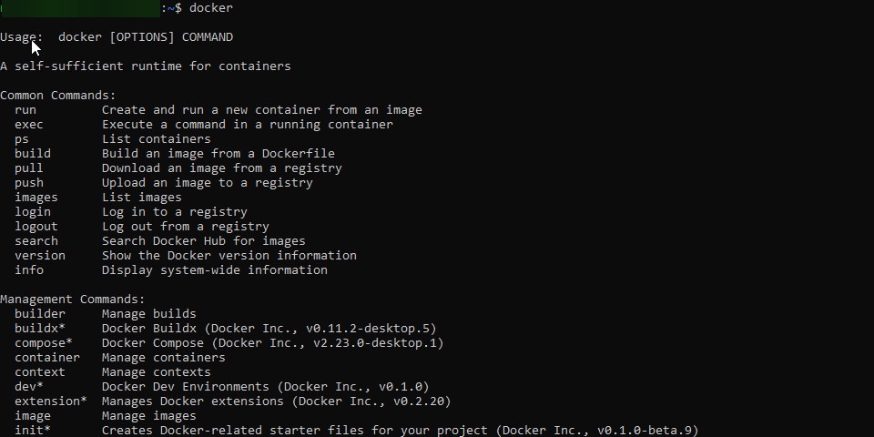

A saída deverá ser como mostra na imagem acima.

Validado que o docker está funcionando. Copie e cole todo o comando a seguir:

### DEPLOY AUTOBRR

```batch
  docker run -d \
  --name autobrr \

  -v /home/SEU_USUARIO/autobrr/config:/config \

  -p 7474:7474 \

  -e TZ=America/Sao_Paulo \

  --restart unless-stopped \

  ghcr.io/autobrr/autobrr:latest
```

**SUBSTITUIA "SEU_USUARIO" PELO USUÁRIO QUE VOCÊ CRIOU.**

Aguarde e abra o docker desktop.

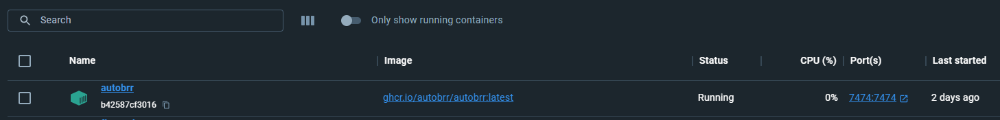

Se tudo ocorrer certo, estará conforme mostra a imagem acima.

## 2. Configurando o Autobrr

Acesse: http://localhost:7474

Deverá ver a seguinte tela:

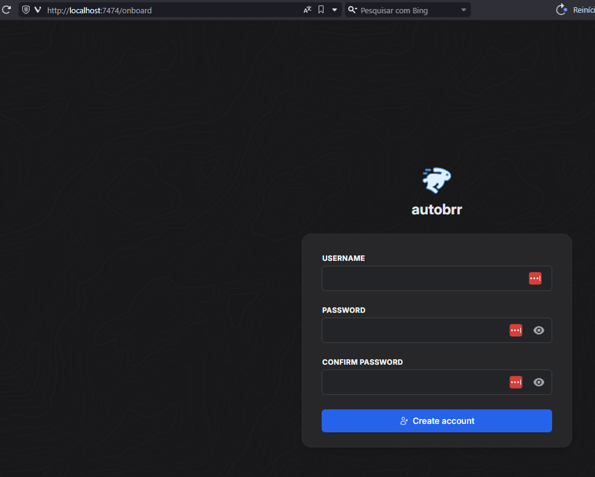

Crie seu usuário e senha.

**ADICIONE SEU CLIENT TORRENT**

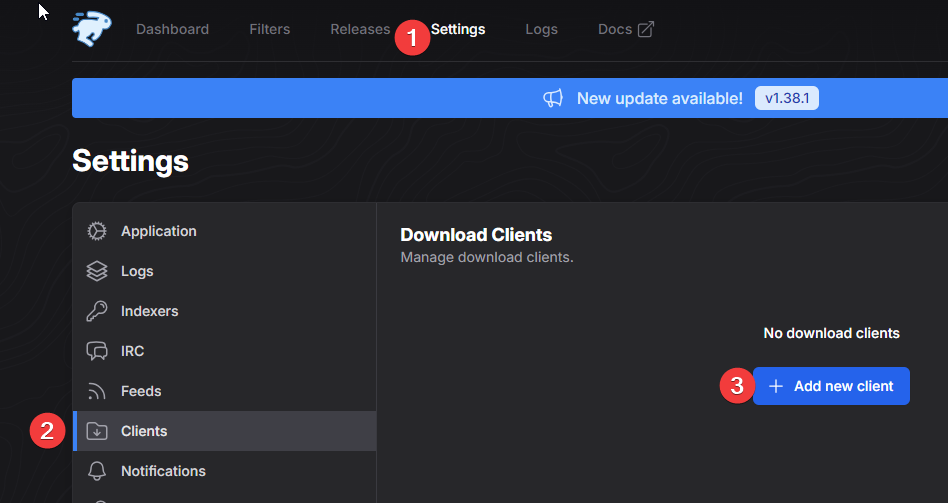

Irá selecionar qual cliente deseja configurar, no exemplo usaremos o qbitorrent

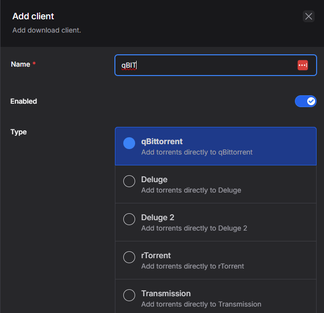

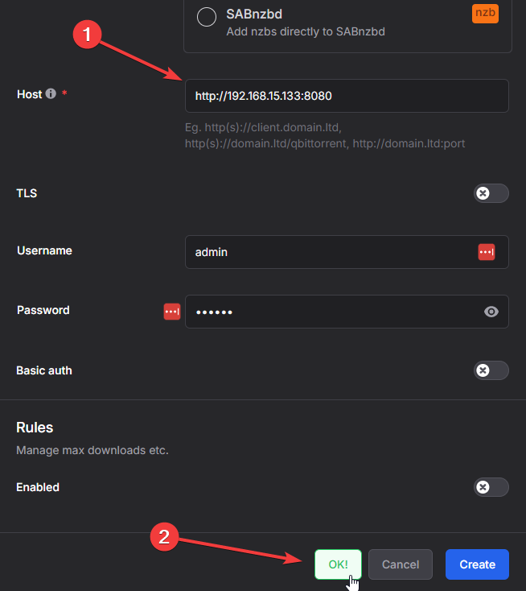

1. Você irá colocar o ip do seu computador, não utilize localhost.
2. Clique em test para validar a conexão, se der ok. Clique em create

## 3. Adicionando Trackers

Não iremos ser específicos nesse ponto, cada tracker possui sua particularidade de configuração. Iremos mostrar as possibilidades, campos para preencher e em caso de dificuldades veja se no fórum do seu tracker tem algo. Ou solicite apoio no nosso grupo.
Considerações:

- Você pode adicionar um tracker usando RSS / iRC / modelo pré-configurado para trackers famosos.
- Nós recomendamos sempre o uso de IRC para trackers que tem suporte, pois o delay é menor

**1. Exemplo usando RSS**
Busque no seu tracker como obter o RSS, não iremos citar trackers específicos aqui neste tutorial.

Após conseguir o RSS do seu tracker, vá em "INDEXERS" e siga o fluxo abaixo

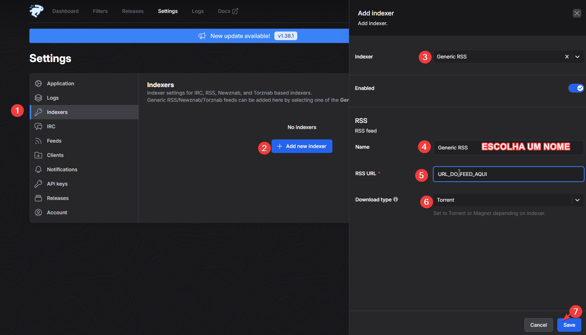

**ATIVE O FEED E AJUSTE O TEMPO DE ATUALIZAÇÃO**

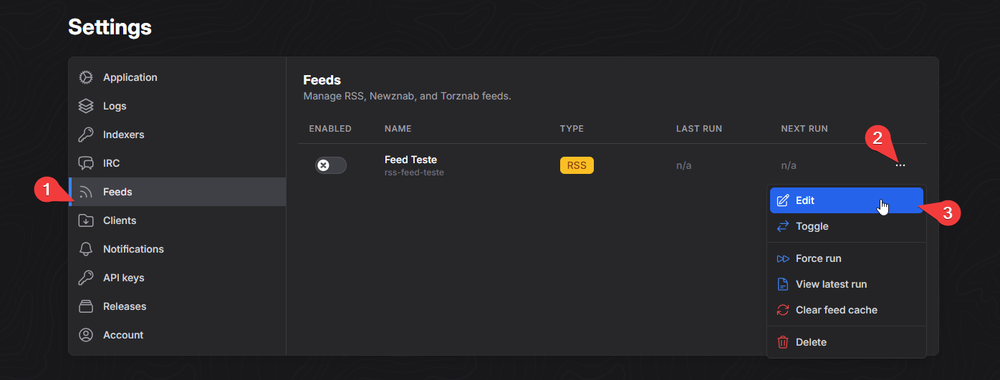

Siga a orientação conforme a imagem Feeds > Edit

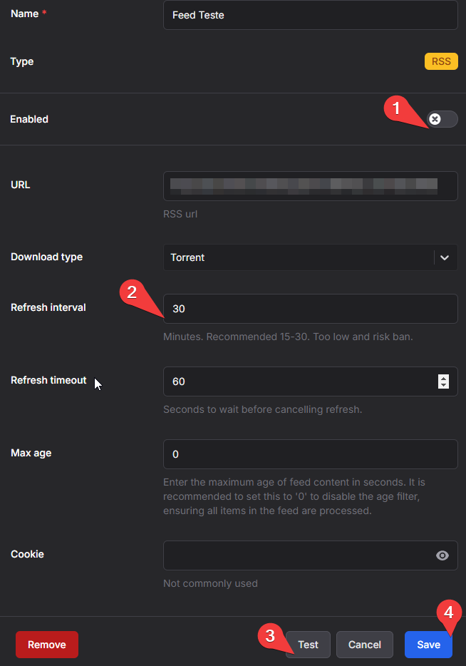

1. Ative o feed
2. Defina o tempo de atualização. (verifique as regras do seu tracker para não usar um tempo muito pequeno) sugerimos 5min.
3. Teste a conexão e salve

**ATIVANDO FILTROS**
Uma das principais funções do autobrr, são os filtros. Aqui que a "mágica acontece". Mostraremos um exemplo de configuração, mas não significa que irá funcionar no seu tracker. Caso não funcione, terá que ajustar para conseguir identificar. Use os logs para ver o que está acontecendo.

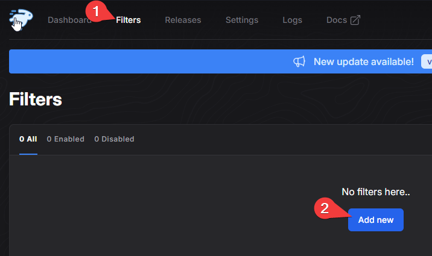

- Após clicar, defina um nome e salve.
  Selecione seu feed:

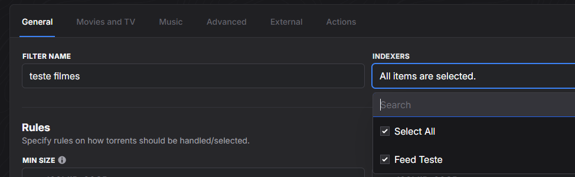

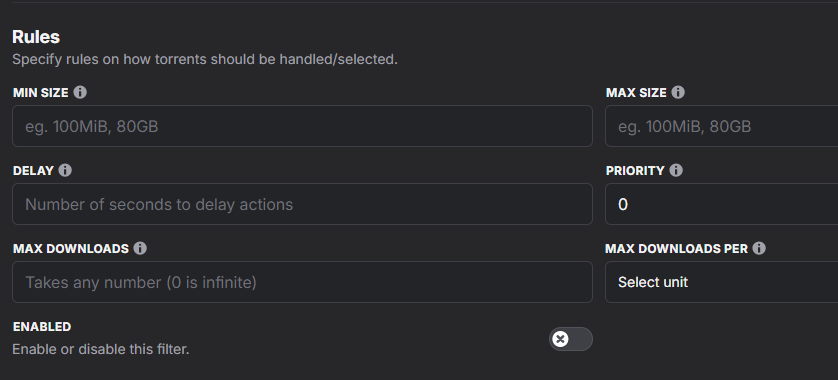

Nos campos acima, você pode definir qual o tamanho mínimo/máximo que deseja baixar.

**ABA "MOVIES & TV"**

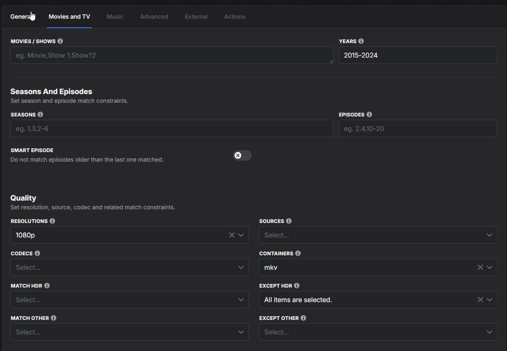

No exemplo acima, está definido para baixar filmes entre os anos 2015 e 2024, com resolução 1080p e o tipo de arquivo sendo .mkv

**ABA "ADVANCED"**
Esta aba possui vários filtros que você pode utilizar valores usando "," ou regex.
Abaixo está um exemplo para baixar filmes de todos os tipos **(aplicável somente em determinado tracker)**

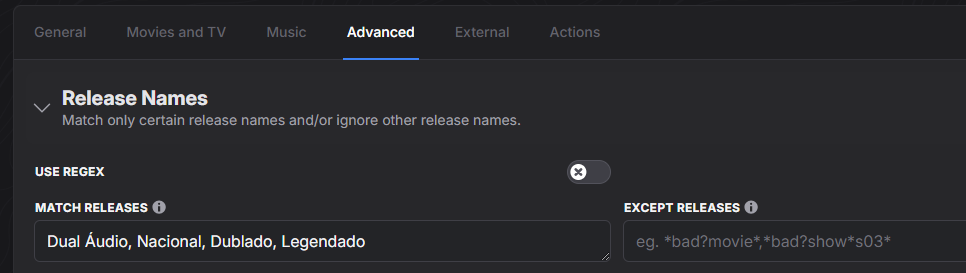

Reforçando... os filtros vão de acordo com cada tracker que você adiciona. Caso não esteja baixando algo que definiu ou não identificando corretamente. Analise os logs para.

**ABA "ACTIONS"**
:::info Na aba de ações, é onde são executados os comandos para mandar o arquivo para seu client torrent, testar para validar seu filtro, etc.
:::
Vamos começar testando, para isso defina conforme a imagem abaixo e salve:

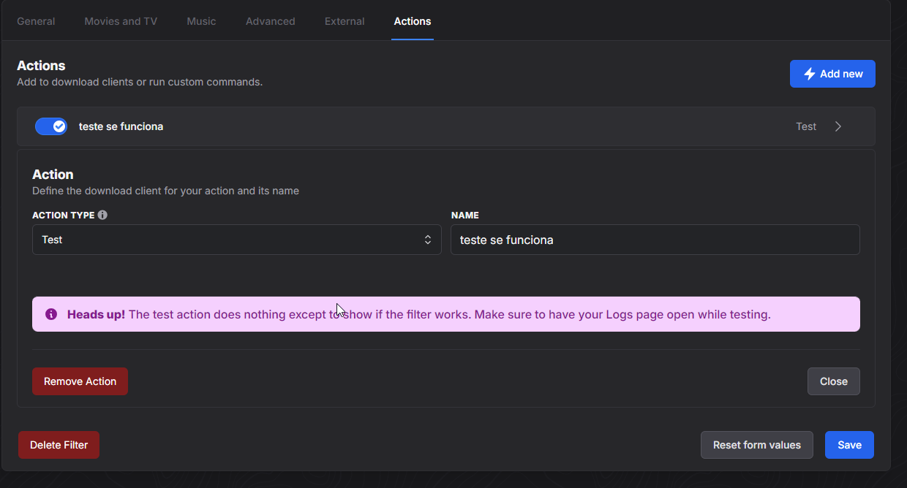

Lembre-se de ativar o filtro:

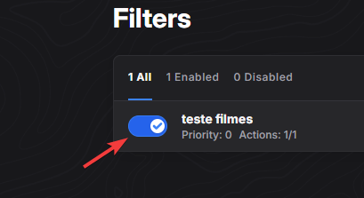

:::info Você pode definir filtros para cada tracker que adicionar.
:::

Deixe o autobrr ativo e aguarde novas atualizações do RSS, se tudo ocorrer certo. Você verá os releases filtrados na aba **RELEASES**

Se estiver OK, volte na aba filtros para editar a ação de test e modificar para enviar para seu client torrent.

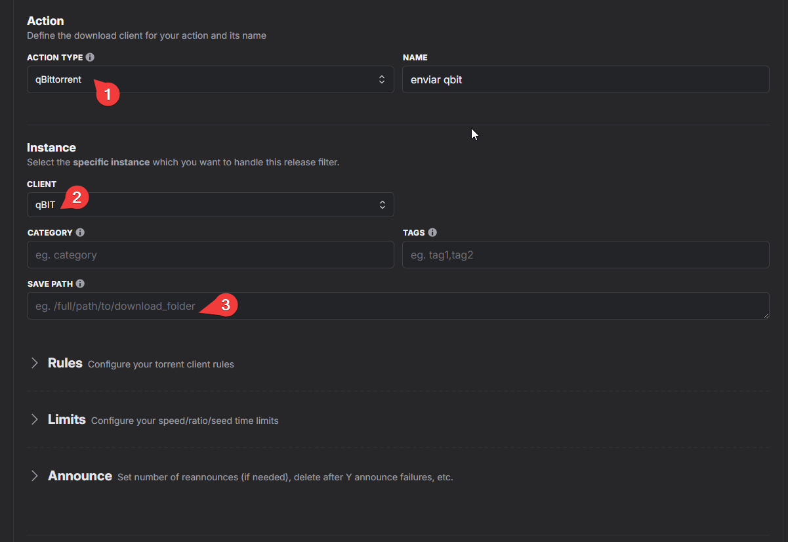

1. Mude o action type, para seu client torrent
2. Selecione o seu cliente torrent que configurou no inicio
3. (opcional) Coloque onde deseja salvar. Se deixar em branco vai baixar na pasta padrão do seu client. Caso coloque, lembre-se de colocar o caminho completo. Ex: C:\User\Desktop\Filmes

Pronto, seu autobrr está configurado e todo novo torrent que aparecer e der "match" no seu filtro será adicionado no seu cliente torrent.

Para mais informações, acesse a documentação oficial: https://autobrr.com

[**Artigo original do CopyrightBR**](https://copyrightbr.com/CFPpqO-yjNL)
