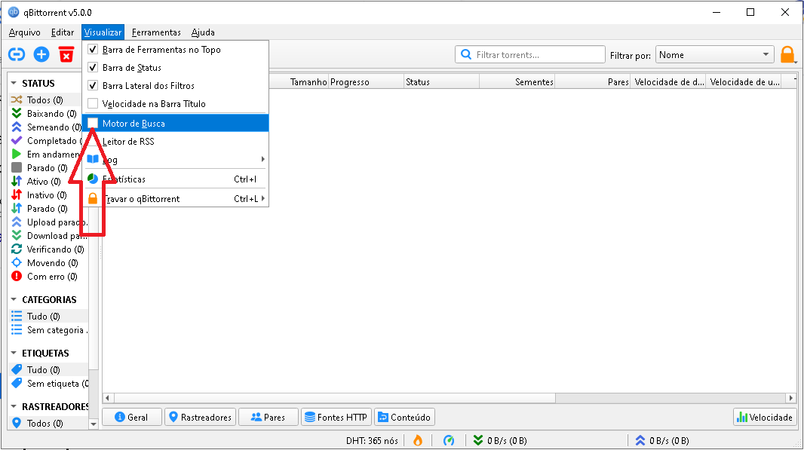
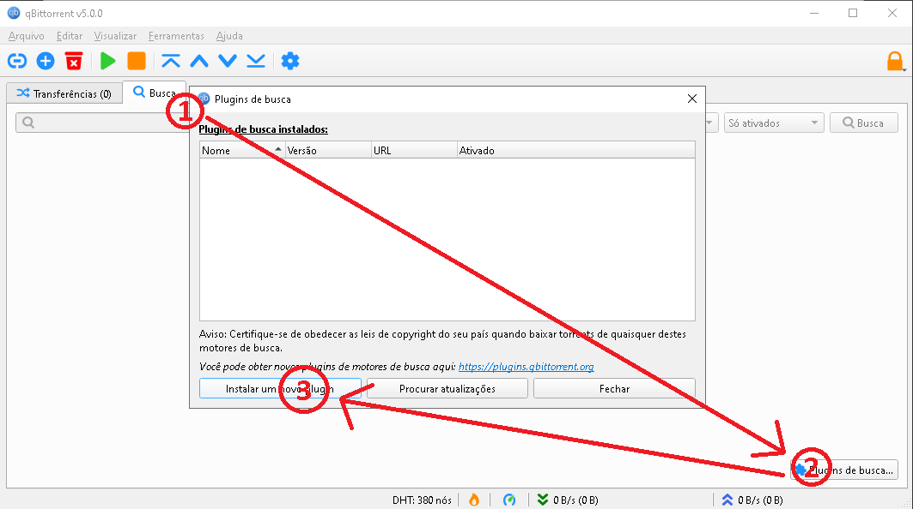

# Passos para instalar plugins de pesquisa para qBitTorrent versão 3.1.10 ou mais recente.

1. Observe que os plugins / scripts de Python são, por sua natureza, não considerados seguros. Portanto, qualquer uso dos plugins não oficiais é por sua conta e risco. É uma boa prática para auditar / dar uma olhada nos plugins / scripts antes de instalar.

2. Vá para: https://github.com/qbittorrent/search-plugins/wiki/Unofficial-search-plugins

   1. Na coluna `Download`, clique no link apropriado de `Download`.
   2. Salve o arquivo `.py` em um local temporário do seu armazenamento.

3. Usando o qBitTorrent.
   Usando a janela principal, clique em `Visualizar` -> `Motor de Busca` para mostrar a guia de pesquisa.
   

   1. Vá para a guia `Busca`.
   2. Clique no botão `Plugins de busca`. Que está localizado no canto inferior direito.
   3. A janela `Plugins de busca` será aberta. Ele mostra uma lista de plug-ins de mecanismos de pesquisa instalados.

      1. Clique no botão `Instalar um novo plugin`.
         
      2. A janela `Fonte do plugin` irá abrir.

         1. Clique no botão `Arquivo local`.
         2. Navegue até o arquivo `.py` que você baixou na etapa anterior. Selecione o arquivo `.py`.
         3. Se for bem-sucedido, o nome do plugin aparecerá na lista dos plugins de busca.
         4. Se não for bem-sucedido, a seguinte mensagem será exibida:
            `Não pôde instalar o plugin do motor de busca ">NOME<". O plugin não é suportado.`
         5. Usando [esta página](https://github.com/qbittorrent/search-plugins/wiki/Unofficial-search-plugins) na coluna `Comment`, verifique se o seu sistema atende aos requisitos mínimos para cada plugin de pesquisa. Talvez o seu sistema atual não tenha os requisitos.
         6. Click no botão `Fechar`.

4. Você pode excluir o arquivo `.py` do seu local temporário no armazenamento local, pois ele não é mais necessário.
5. Opcionalmente, você pode clicar no botão `Link da web` e inserir a URL do plugin.

Feito. Você instalou com sucesso um novo plugin de pesquisa para qBittorrent.

Guia sugerido por [u/Dehast](https://www.reddit.com/u/Dehast).

Guia baseado em [qbittorrent search plugins install wiki](https://github.com/qbittorrent/search-plugins/wiki/Install-search-plugins)
