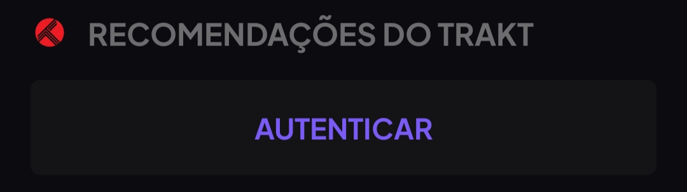

### Guia básico de como usar Stremio.

Stremio é um agregador de conteúdo e também um player, ele tem suporte para várias plataformas e é muito bom quando combinado com certos add-ons e bem configurado.

Neste guia, quero mostra o básico necessário para que o Stremio funcione.

Você pode começar abaixando ele da [aqui](https://www.stremio.com) e criando uma conta logo depois.

### Add-ons.

Add-ons são complementos que adicionam recursos ao Stremio, como novas fontes para a realização de streaming, novos catálogos e outros.

O Stremio vem com alguns add-ons pre instalados, sendo uns removíveis e outros não, sinta-se à vontade para remover add-ons como WatchHub, YouTube e Public Movies Domains, já que eles não serão tão uteis.

Você pode achar novos add-ons no menu do aplicativo, assim como no [site](https://stremio-addons.com/) e [subreddit](https://www.reddit.com/r/StremioAddons/) do Stremio Addons.

:::info Ordenação
Dependendo da ordem de instalação dos add-ons, ela pode impacta quais resultados/catálogos serão exibidos primeiros.
:::

#### Provedores.

Os provedores buscam a mídia na Internet e retornam com o resultado quando possível, é com eles que você conseguirá o arquivo para assistir ao conteúdo.

Cada provedor tem uma forma de funcionar, podendo ser via Torrent(ponta-a-ponta), HTTP, Debrid, e outros.

::: warning Torrent
Ao baixar um torrent, você expõe para a Internet que está fazendo o download de tal arquivo, existe uma pequena chance de receber uma ocorrência do seu ISP, isso varia com as leis de cada país.
:::

Recomendo esses provedores, que fornecem conteúdo em português:

- [🧲 Brazuca Torrents](https://stremio-addons.com/brazuca-torrents.html).
- [🧲 Brazuca Torrentio](https://stremio-addons.com/torrentio-brazuca.html).
- [🔗 Skyflix](https://stremio-addons.com/skyflix.html).

#### Catálogos.

Catálogos disponibilizam os filmes, series, e outros que irão aparecer na tela inicial.

Cinemeta já vem pre instalado com o Stremio, e não é removível, ele somente possui informações em inglês, que podem estar desatualizadas, contudo, é interessante ter outro add-on de catálogo.

:::info Rating Poster Database (RPDB).
Alguns add-ons fornecem suporte ao RPDB, que fornece avaliações nas capas do catálogo. Use a chave **t0-free-rpdb** para usar o tier gratuito.
:::

- [🎬 Cyberflix Catalog](https://stremio-addons.com/cyberflix-catalog.html) — Fornece o catálogo de várias fontes.
- [🎬 TMDB](https://stremio-addons.com/the-movie-database-addon.html) — Fornece o catálogo do The Movie Database, há uma opção para incluir o Streaming Catalogs junto.
- [🎬 Streaming Catalogs](https://stremio-addons.com/streaming-catalogs.html) — Fornece o catálogo de várias fontes.
- [🌸 Kitsu](https://stremio-addons.com/anime-kitsu.html) — Fornece o catálogo do Kitsu.
- [🌸 Anime Catalogs](https://1fe84bc728af-stremio-anime-catalogs.baby-beamup.club/configure) — Fornece o catálogo de várias fontes.

#### Trackers.

Trackers são rastreadores de episódios, eles irão salvar filmes e séries que você já assistiu.

O Stremio já vem com o Trakt.tv integrado, caso queira usar, vá para as configurações e procure “RECOMENDAÇÕES DO TRAKT”

e clique em autorizar, após isso crie ou faça login com sua conta.

Caso utilize outro tracker, você pode usar add-ons para realizar a sincronização:

- [Animeo](https://stremio-addons.com/animeo.html) — Anilist.
- [SyncriBullet](https://stremio-addons.com/syncribullet.html) — Anilist e SIMKL.

> **Créditos:** > [viren070](https://guides.viren070.me/stremio) e [bye-sudo](https://rentry.co/bye-sudo)
>
> Tradução por [yuzamei2854](https://github.com/yuzamei2854)
