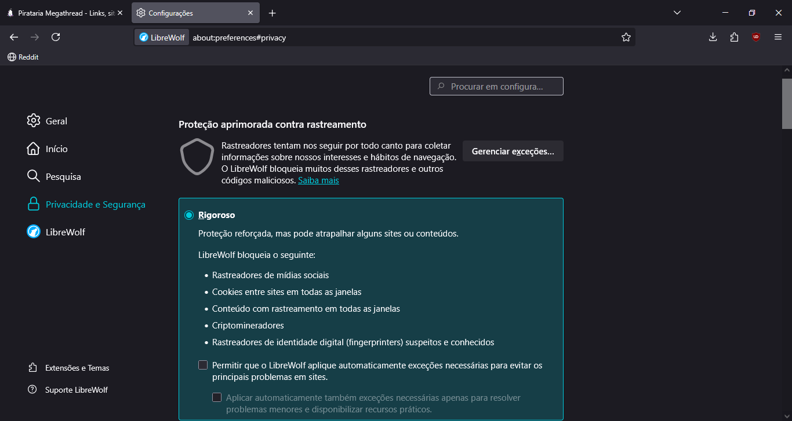
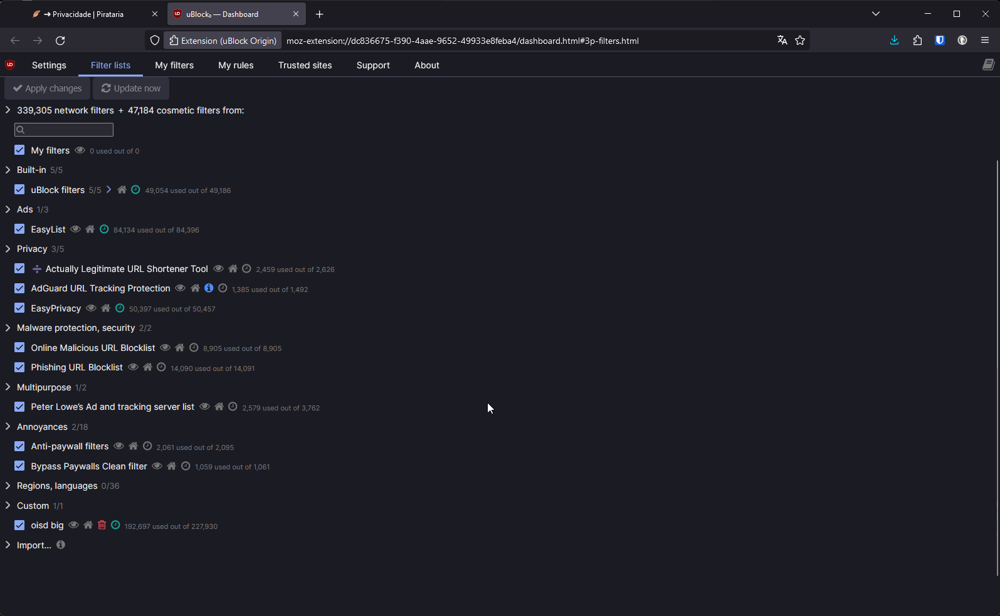
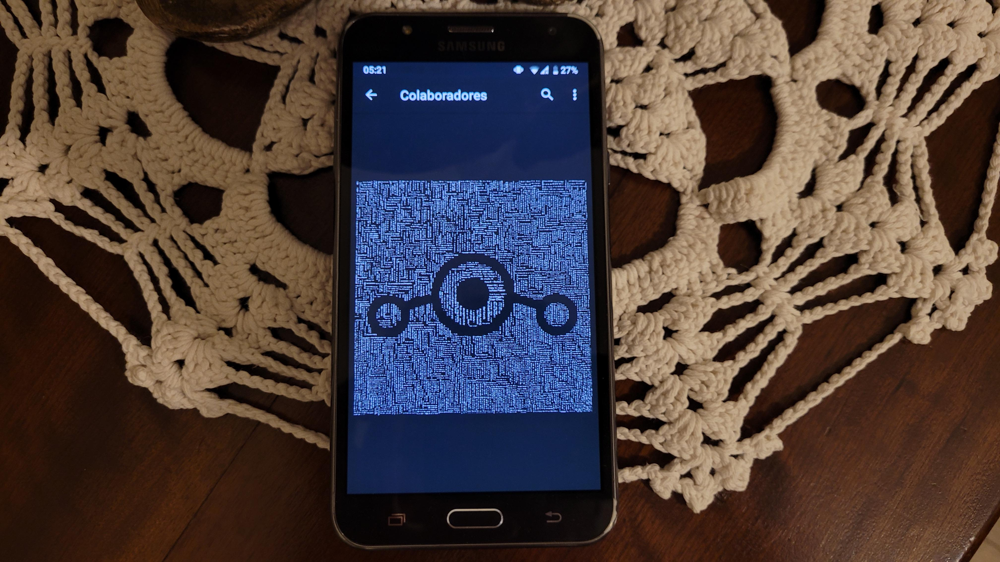

# 🪶 ➜ Privacidade

:::info Essa página ainda é um esboço. Feito com base nas recomendações do [PrivacyGuides](https://www.privacyguides.org/) e [Spyware Watchdog](https://spyware.neocities.org/).
:::

## Panorama da Segurança

A privacidade na internet é crucial para encontrar um equilíbrio entre a transparência e o anonimato. Embora seja importante responsabilizar aqueles que cometem crimes ou propagam conteúdos prejudiciais na internet, também é essencial garantir que as pessoas possam se expressar anonimamente quando necessário, sem medo de represálias ou exposição excessiva. Esse equilíbrio protege a liberdade de expressão e a diversidade de vozes, permitindo que todos tenham a oportunidade de participar do espaço digital de maneira segura e inclusiva.

> "O ciclo da vida: consumir recursos para produzir objetos que logo se tornarão lixo. Dados são coletados para criar desejos, lucro e poder, e para gerar medo, autocensura e resignação. Viver com medo é realmente uma experiência marcante, não é? Isso é o que significa ser um escravo." - [autistici.org](https://www.autistici.org/who/telltale)

## A visita policial

Em hipótese alguma permita a entrada deles na sua residência sem mandado judicial, que é um documento redigido e assinado por um juiz competente para busca e apreensão. No caso de insistência ou ameaças, peça licença e diga que irá chamar seu advogado imediatamente, e o faça! Relate o ocorrido e aguarde sua chegada para continuar o diálogo. Vejamos o que diz o seguinte preceito constitucional:

> Art. 5º, XI - a casa é asilo inviolável do indivíduo, ninguém nela podendo penetrar sem consentimento do morador, salvo em caso de flagrante delito ou desastre, ou para prestar socorro, ou, durante o dia, por determinação judicial;

A inviolabilidade do lar só pode ser excepcionada em casos de flagrante delito, desastre ou para prestar socorro. Além disso, durante o dia, a entrada na residência sem consentimento só é permitida mediante determinação judicial, em conformidade com o Artigo 5º, Inciso XI, sendo necessária a emissão de um mandado judicial para adentrar na casa de alguém. Essa proteção legal é essencial para garantir os direitos fundamentais dos cidadãos e preservar a integridade do processo legal, conforme estabelecido pelo Artigo 5º, Inciso LVI, que veda a utilização de provas obtidas por meios ilícitos.

> Art. 5º, LVI - são inadmissíveis, no processo, as provas obtidas por meios ilícitos;

### Lei nº 13.869/2019 (Nova Lei de Abuso de Autoridade)

> Art. 22. § 1º I - coage alguém, mediante violência ou grave ameaça, a franquear-lhe o acesso a imóvel ou suas dependências;

> Art. 22. § 1º III - cumpre mandado de busca e apreensão domiciliar após as 21h (vinte e uma horas) ou antes das 5h (cinco horas).

## Navegadores

### [Mullvad Browser](https://mullvad.net/en/browser)

O Navegador Mullvad é uma versão do Navegador Tor com as integrações do roteamento onion removidas, com o objetivo de fornecer as tecnologias de anti-reconhecimento do Browser. Ele é gratuito e desenvolvido pelo Projeto Tor e distribuído pela Mullvad, e não requer o uso da VPN da Mullvad.

- Anti-Fingerprinting
- Modo de navegação privativa

:::info Disponível para Windows e Linux.
:::

### [Librewolf](https://librewolf.net/)

O Librewolf é um navegador orientado para a privacidade baseado no Firefox. Habilita o recurso upstreamed do RFP pelo projeto Tor Uplift e já vem com o Ublock Origin pré-instalado.

- Tecnologia Anti-Fingerprinting (Forte)
- Não é afiliado com a Mozilla Foundation
- Sem telemetria (coleta de dados sobre o uso do usuário)

### [Ungoogled Chromium](https://github.com/ungoogled-software/ungoogled-chromium)

É um projeto opensource (código aberto), baseado em Chromium, mas sem manipulação do Google: remove os serviços e rastreamento do Google e telemetria.
Todavia requer que o usuário configure de maneira manual, para uma privacidade ainda mais robusta.

:::tip É fundamental que você use [isso](https://github.com/NeverDecaf/chromium-web-store).
:::

### [Cromite](https://github.com/uazo/cromite)

O Cromite é um fork do Chromium baseado no fork do Bromite com bloqueio de anúncios e aprimoramentos de privacidade.

- Anti-Fingerprinting
- Adblock Plus
- Baseado em Chromium

:::info Disponível para Android, Windows e Linux.
:::

## Gerenciador de Senhas

### [Bitwarden](https://bitwarden.com/)

O Bitwarden é um gerenciador de senhas de código aberto e plataforma de segurança de dados que permite armazenar de forma segura senhas, cartões de crédito e outros dados confidenciais. Ele oferece recursos como preenchimento automático de senhas, geração segura de senhas, compartilhamento seguro de senhas com outras pessoas e sincronização de dados entre dispositivos. O Bitwarden é acessível através de aplicativos para desktop, navegador e dispositivos móveis, garantindo acesso fácil e seguro às suas credenciais em qualquer lugar.

:::info Você pode criar sua própria instância do Bitwarden, instalando o Vaultwarden em seu servidor. Somente para usúarios avançados.
:::

### [KeePassXC](https://keepassxc.org/)

O KeePassXC é um gerenciador de senhas de código aberto e local, projetado para armazenar e gerar senhas seguras de forma criptografada. Ele oferece recursos como a organização de senhas em um banco de dados protegido por senha mestre, autenticação de dois fatores e a capacidade de sincronização de banco de dados entre dispositivos. O KeePassXC é altamente personalizável e suporta uma variedade de recursos adicionais, como anexos de arquivos e campos personalizados.

## VPN

Uma VPN (Virtual Private Network - Rede Virtual Privada) é uma tecnologia que cria uma conexão segura e criptografada entre o dispositivo do usuário e um servidor remoto. Essa conexão permite que o usuário navegue na internet de forma segura, protegendo sua privacidade e anonimato online. As VPNs são utilizadas para ocultar o endereço IP do usuário, contornar restrições geográficas, proteger dados sensíveis contra hackers em redes públicas, e acessar conteúdos bloqueados por governos ou empresas. Elas funcionam criptografando o tráfego de dados, tornando-o ilegível para qualquer pessoa que tente interceptá-lo. As VPNs também podem ser usadas para acesso remoto a redes corporativas de forma segura. No entanto, é importante escolher um provedor de VPN confiável que mantenha uma política rigorosa de não registro e ofereça velocidades de conexão satisfatórias.

### [Mullvad VPN](https://mullvad.net/)

- Barata, com vários servidores e rápida
- Mullvad Leta
- Suporta Monero

### [IVPN](https://www.ivpn.net/)

- Ótima alternativa para a Mullvad VPN

### [ProtonVPN](https://protonvpn.com)

- Suporta port-forwarding, fazendo suportar a rede P2P (peer-to-peer)

### [AirVPN](https://airvpn.org/buy/)

- Suporta port-forwarding, fazendo suportar a rede P2P (peer-to-peer)
- Suporta Monero

:::warning AirVPN deve ser a última opção como VPN, seus servidores não são bons.
:::

## Bloqueador de anúncios e trackers

### [uBlock Origin](https://ublockorigin.com/)

O uBlock Origin é uma extensão de navegador popular projetada para bloquear anúncios, rastreadores e outros elementos indesejados em páginas da web. Ele funciona filtrando o conteúdo da página em tempo real, impedindo que anúncios sejam carregados, o que resulta em uma experiência de navegação mais rápida e limpa. Além de bloquear anúncios, o uBlock Origin também oferece opções avançadas de filtragem, permitindo que os usuários personalizem suas configurações conforme necessário. Esta extensão é conhecida por sua eficácia, baixo consumo de recursos e pela capacidade de proteger a privacidade dos usuários, bloqueando rastreadores e scripts maliciosos.

:::info Adicionar a lista [oisd.nl](https://oisd.nl) como lista adicional.
:::

### [Pi-hole](https://pi-hole.net/)

O Pi-hole é uma solução de bloqueio de anúncios e filtragem de conteúdo baseada em rede, geralmente implementada em um Raspberry Pi ou em um servidor local. Funciona como um servidor DNS que intercepta solicitações de DNS feitas por dispositivos na rede e bloqueia solicitações para servidores de anúncios e domínios de conteúdo indesejado. Isso melhora a velocidade de navegação, reduz o consumo de largura de banda e aumenta a privacidade, já que muitos rastreadores e anúncios são bloqueados antes de serem carregados. O Pi-hole também fornece estatísticas detalhadas sobre o tráfego de rede e os domínios bloqueados, permitindo um controle mais preciso sobre o fluxo de dados na rede local.

:::info Utilizar a lista do [PerfLyst](https://github.com/Perflyst/PiHoleBlocklist) para bloquear anúncios na SmartTV
:::

:::warning O Pi-hole é somente para usúarios avançados
:::

## Provedores de E-mail

### [Mailbox.org](https://mailbox.org/)

Mailbox.org é um serviço de e-mail baseado na Alemanha que oferece recursos avançados de privacidade e segurança. Ele fornece aos usuários endereços de e-mail personalizáveis, armazenamento de e-mail criptografado, filtro de spam eficiente e uma interface de usuário amigável. Além disso, o Mailbox.org oferece recursos como calendário, contatos, armazenamento de arquivos e ferramentas de colaboração, tornando-se uma solução abrangente para comunicação e produtividade. Sua ênfase na privacidade inclui criptografia de ponta a ponta, políticas rígidas de proteção de dados e opções de pagamento anônimo.

## Sistema Operacional Android

### [GrapheneOS](https://grapheneos.org/)

Um sistema operacional mobile privado e seguro com compatibilidade de aplicativos Android. Desenvolvido como um projeto de código aberto sem fins lucrativos.

- Só suporta Google Pixel

### [LineageOS](https://lineageos.org/)

- Suporta celulares antigos que não recebem mais atualizações de segurança
- A linha da Motorola é a mais acessível no Brasil

## Criptografia de disco

### [Veracypt](https://www.veracrypt.fr/en/Home.html)

O VeraCrypt adiciona segurança aprimorada aos algoritmos usados ​para criptografia de sistemas e partições, tornando-o imune a novos desenvolvimentos em ataques de força bruta.

## Criptografia de nuvem

### [Cryptomator](https://cryptomator.org/)

O Cryptomator fornece criptografia transparente client-side para sua nuvem. Protege seus documentos contra acesso não autorizado. O Cryptomator é um software gratuito e de código aberto, então você pode ter certeza de que não há backdoors.

### [Nextcloud](https://nextcloud.com/)

O Nextcloud é uma plataforma de colaboração e armazenamento em nuvem de código aberto, projetada para permitir que indivíduos e organizações gerenciem e compartilhem seus arquivos de forma segura e eficiente. Ele oferece uma ampla gama de recursos, incluindo armazenamento de arquivos, calendário, contatos, compartilhamento de documentos e colaboração em tempo real. O Nextcloud é altamente personalizável e pode ser instalado em **servidores locais ou em provedores de nuvem de terceiros**, oferecendo assim maior controle sobre os dados e garantindo conformidade com requisitos de segurança e privacidade.

## Leitura recomendada

- [Guia de privacidade para paranoicos](/guias/quero-privacidade.md)
