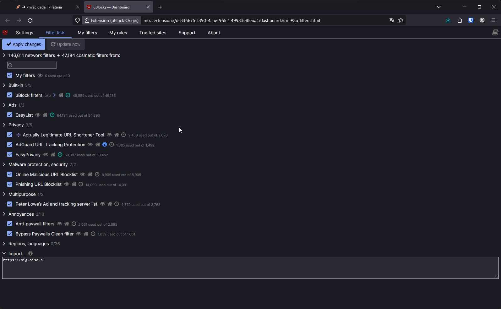
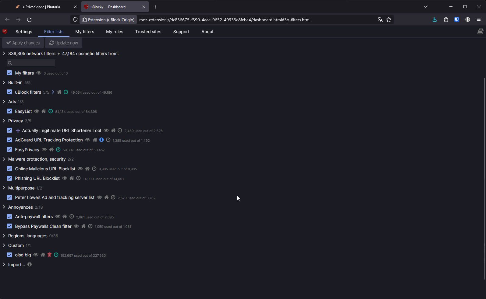

# 🪶 ➜ Privacidade

:::info Essa página ainda é um esboço.
:::

## Panorama da Segurança

A privacidade na internet é crucial para encontrar um equilíbrio entre a transparência e o anonimato. Embora seja importante responsabilizar aqueles que cometem crimes ou propagam conteúdos prejudiciais na internet, também é essencial garantir que as pessoas possam se expressar anonimamente quando necessário, sem medo de represálias ou exposição excessiva. Esse equilíbrio protege a liberdade de expressão e a diversidade de vozes, permitindo que todos tenham a oportunidade de participar do espaço digital de maneira segura e inclusiva.

## A visita policial

Em hipótese alguma permita a entrada deles na sua residência sem mandado judicial, que é um documento redigido e assinado por um juiz competente para busca e apreensão. No caso de insistência ou ameaças, peça licença e diga que irá chamar seu advogado imediatamente, e o faça! Relate o ocorrido e aguarde sua chegada para continuar o diálogo. Vejamos o que diz o seguinte preceito constitucional:

> Art. 5º, XI - a casa é asilo inviolável do indivíduo, ninguém nela podendo penetrar sem consentimento do morador, salvo em caso de flagrante delito ou desastre, ou para prestar socorro, ou, durante o dia, por determinação judicial;

A inviolabilidade do lar só pode ser excepcionada em casos de flagrante delito, desastre ou para prestar socorro. Além disso, durante o dia, a entrada na residência sem consentimento só é permitida mediante determinação judicial, conforme o Artigo 5º, Inciso XI, sendo necessária a emissão de um mandado judicial para adentrar na casa de alguém. Essa proteção legal é essencial para garantir os direitos fundamentais dos cidadãos e preservar a integridade do processo legal, conforme estabelecido pelo Artigo 5º, Inciso LVI, que veda a utilização de provas obtidas por meios ilícitos.

> Art. 5º, LVI - são inadmissíveis, no processo, as provas obtidas por meios ilícitos;

### Lei nº 13.869/2019 (Nova Lei de Abuso de Autoridade)

> Art. 22. § 1º I - coage alguém, mediante violência ou grave ameaça, a franquear-lhe o acesso a imóvel ou suas dependências;

> Art. 22. § 1º III - cumpre mandado de busca e apreensão domiciliar após às 21h (vinte e uma horas) ou antes das 5h (cinco horas).

## Violação de direito autoral

### Lei n° 9.610/1998

> Art. 46. Título II - Não constitui ofensa aos direitos autorais: a reprodução, em um só exemplar de pequenos trechos, para uso privado do copista, desde que feita por este, sem intuito de lucro;

E o mesmo artigo, no Título I, Alínea d, estabelece que está permitida a reprodução:

> de obras literárias, artísticas ou científicas, para uso exclusivo de deficientes visuais, sempre que a reprodução, sem fins comerciais, seja feita mediante o sistema Braille ou outro procedimento em qualquer suporte para esses destinatários;

## Navegadores

- [Firefox](https://www.firefox.com/en-US/download/all/) + [arkenfox/user.js](https://github.com/arkenfox/user.js/)
- [Mullvad Browser](https://mullvad.net/en/browser)
- [Tor Browser](https://www.torproject.org)
- [Helium](https://helium.computer/)
- [LibreWolf](https://librewolf.net/)
- [Cromite](https://github.com/uazo/cromite)

## Gerenciador de Senha
- [KeePassXC ](https://keepassxc.org/)+ [Nextcloud](https://nextcloud.com/)
- [Bitwarden](https://bitwarden.com/)
- [dani-garcia/vaultwarden](https://github.com/dani-garcia/vaultwarden) (Bitwarden, porém autohospedado)

## VPN
- [IVPN](https://www.ivpn.net)
- [Mullvad](https://mullvad.net/)
- [AirVPN](https://airvpn.org/buy/) / Suporta port-forwarding, fazendo suportar a rede P2P (peer-to-peer)

## Nuvem
- [Nextcloud](https://nextcloud.com/) (Autohospedado)
- [Tresorit](https://tresorit.com/)
- [Peergos](https://peergos.org/)

## Criptografia
- OpenPGP
- Kleopatra
- OpenKeychain no Android
- [VeraCrypt](https://veracrypt.io) (Windows/Linux), criptografia de disco e de pastas/arquivos.
- [Cryptomator](https://cryptomator.org/) (Windows/Linux/Android), criptografia de arquivos, os arquivos são criptografados separadamente e não somente em um bloco.
- [RClone](https://rclone.org/) com qualquer serviço de armazenamento em nuvem.
- Linux Unified Key Setup (LUKS)

## Email
- [Mailbox.org](https://mailbox.org)
- [Tuta](https://tuta.com/)
- [PurelyMail](https://purelymail.com/)
- [ProtonMail](https://proton.me/mail)

## XMPP
- Use servidores e clientes que suportam OMEMO/OpenPGP
- Windows/Linux: [Gajim](https://gajim.org/download/)
- MacOS/IOS: [Monal](monal-im.org/)
- Browser: [Movim](mov.im)
- Android: [Conversations](f-droid.org/en/packages/eu.siacs.conversations/), tem o Monocles também e outros.

## Desktop
- Linux (distros como [Arch](https://archlinux.org/), [Qubes OS](https://www.qubes-os.org/), [Fedora](https://fedoraproject.org/), [NixOS](https://nixos.org/)
- Live Boot em Flash Drive com [Whonix](https://www.whonix.org/)/[Tails OS](https://tails.net/)

## Rede social
- Lemmy, Session, Mastodon, XMPP e Matrix ([Element](https://element.io))

## Provedor de dominio
- Cloudflare ou Porkbun, preciso de mais sigilo? Vá de Njalla.
- [Njal.la](https://njal.la/)

## Meet
- [Jit.si](https://meet.jit.si/)

## Criptomoeda
- [Monero (XMR)](https://www.getmonero.org/)

## Motor de Pesquisa
- [DuckDuckGo](https://duckduckgo.com/)
- [Kagi](https://kagi.com/)

## Roteador
- Qualquer um que suporte [OpenWRT](https://openwrt.org/)
- [Pi-hole](https://pi-hole.net/) com lista do [oisd.nl](https://oisd.nl/)
- [pfSense](https://www.pfsense.org/) ou OPNSense.

## Hospedagem
- [Servers.guru](https://servers.guru)
- [Njal.la](https://njal.la/)

## SMS
- [jmp.chat](https://jmp.chat)
- [VirtualSIM](https://virtualsim.net)

## Bloqueador de anúncios e rastreadores

### [uBlock Origin](https://ublockorigin.com/)

O uBlock Origin é uma extensão de navegador robusta projetada para bloquear anúncios, rastreadores e outros elementos indesejados em páginas da web. Ele funciona filtrando o conteúdo da página em tempo real, impedindo que anúncios sejam carregados, o que resulta em uma experiência de navegação mais rápida e limpa. Além de bloquear anúncios, o uBlock Origin também oferece opções avançadas de filtragem, permitindo que os usuários personalizem suas configurações conforme necessário. Esta extensão é conhecida por sua eficácia, baixo consumo de recursos e pela capacidade de proteger a privacidade dos usuários, bloqueando rastreadores e scripts maliciosos.

:::info Adicionar a lista [oisd.nl](https://oisd.nl) como lista adicional.
:::

### [Pi-hole](https://pi-hole.net/)

O Pi-hole é uma solução de bloqueio de anúncios e filtragem de conteúdo baseada em rede, geralmente implementada em um Raspberry Pi ou em um servidor local. Funciona como um servidor DNS que intercepta solicitações de DNS feitas por dispositivos na rede e bloqueia solicitações para servidores de anúncios e domínios de conteúdo indesejado. Isso melhora a velocidade de navegação, reduz o consumo de largura de banda e aumenta a privacidade, já que muitos rastreadores e anúncios são bloqueados antes de serem carregados. O Pi-hole também fornece estatísticas detalhadas sobre o tráfego de rede e os domínios bloqueados, permitindo um controle mais preciso sobre o fluxo de dados na rede local.

## Clientes de E-mail

### [Thunderbird](https://www.thunderbird.net/pt-BR/)

O Thunderbird pode tornar a comunicação mais segura através do suporte integrado para proxy SOCKS5, DNS-over-HTTPS e criptografia de mensagens. Também oferece forte proteção para o seu provedor de e-mail favorito (seja ele IMAP ou POP3) e recursos avançados de privacidade como chat via protocolo XMPP ou IRC. Além disso, se destaca dos demais clientes de e-mail ao impedir a execução automática de scripts e imagens embutidas por padrão, resultando em um ambiente isolado e capaz de barrar o compartilhamento de malware em uma cadeia de dispositivos. 

- Referência para outros projetos sem ligação com a Mozilla como o [Betterbird](https://www.betterbird.eu/) e o [K-9 Mail](https://k9mail.app/).

## Sistema Operacional Android

### [GrapheneOS](https://grapheneos.org/)

Um sistema operacional mobile privado e seguro com compatibilidade de aplicativos Android. Desenvolvido como um projeto de código aberto sem fins lucrativos.

- Só suporta a linha Google Pixel, praticamente inexistente no Brasil
- Pode restringir totalmente o uso da internet por aplicativos

### [LineageOS](https://lineageos.org/)

- Suporta celulares antigos que não recebem mais atualizações de segurança
- A linha da Motorola é a mais acessível no Brasil
- Pode restringir totalmente o uso da internet por aplicativos

### [Serviços Sem KYC (Know Your Customer)](https://kycnot.me/)

Encontre corretoras de criptomoedas, carteiras (wallets), VPNs e outros serviços que não exigem KYC (processo de verificação de identidade) — todos verificados e classificados por nível de privacidade. Use criptomoedas sem precisar enviar documentos, comprovar sua identidade ou apresentar um documento oficial emitido pelo governo.
- [kycnot.me](https://kycnot.me/)

